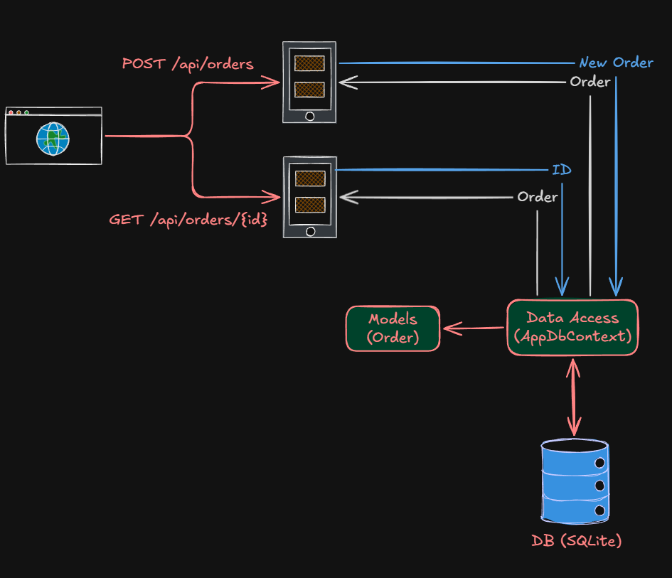

# OrdersApi

This is a sample ASP.NET Core Web API project demonstrating the implementation of CQRS (Command Query Responsibility Segregation) pattern for managing orders.

## Before

## Features

- Order management with CRUD operations
- CQRS architecture separating commands and queries
- Entity Framework Core for data persistence
- In-memory database for development

## Getting Started

1. Ensure you have .NET 10 SDK installed.
2. Clone or download the project.
3. Run `dotnet restore` to install dependencies.
4. Run `dotnet run` to start the application.

## Project Structure

- `Models/`: Contains the Order entity model.
- `Data/`: Contains the database context and migrations.
- `Controllers/`: API controllers (if any).
- `Program.cs`: Application entry point.

## Credits

This project is inspired by and follows the tutorial from Les Jackson's YouTube video:  
[CQRS with ASP.NET Core - Full Tutorial](https://youtu.be/PSlsP8osEGI?si=UkCE6qi0w3Yl77uC)

## License

This project is for educational purposes.